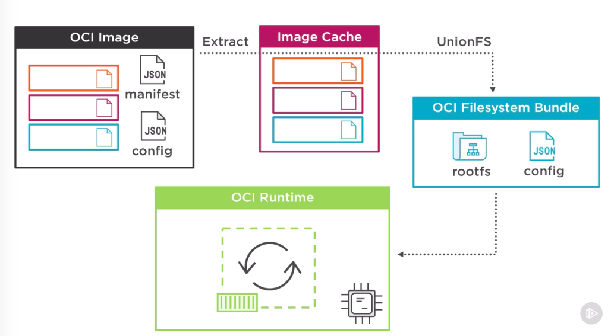

# Docker

### What are Containers?
Containers are an abstraction at the app layer that packages code and dependencies together. 

Multiple containers can run on the same machine and share the OS kernel with other containers, each running as isolated processes in user space. Containers take up less space than VMs (container images are typically tens of MBs in size), can handle more applications and require fewer VMs and Operating systems.

### Docker on Windows

### Open Container Initiative
Docker and other leaders in the container industry, the OCI currently contains two specifications: the Runtime Specification (runtime-spec) and the Image Specification (image-spec).

### Container Lifecycle:
When we create container with `docker run`, image goes in running state. From *running* state we can *start* it, *stop* it and again *start* it. And eventually we can remove the image by `docker rmi`

### Docker Commands:
- `docker run <image>`  : To start new container with at least image to work with.
- `docker pull <image>` : To pull the docker image from Docker hub or ACR locally.
- `docker images` : To list the image pull locally on docker host.
- `docker rmi` : Removes the local image from docker host.
- `docker ps` : Lists all running containers.
- `docker stop` : Stops the running container.
- `docker rm` : removes/delete the **stopped** containers.

## Swarm
A swarm is a group of machines that are running Docker and joined into a cluster. After that has happened, you continue to run the Docker commands you’re used to, but now they are executed on a cluster by a **swarm manager**. The machines in a swarm can be physical or virtual. After joining a swarm, they are referred to as **nodes**.

Up until now, you have been using Docker in a single-host mode on your local machine. But Docker also can be switched into **swarm mode**, and that’s what enables the use of swarms. Enabling swarm mode instantly makes the current machine a swarm manager. From then on, Docker runs the commands you execute on the swarm you’re managing, rather than just on the current machine.
